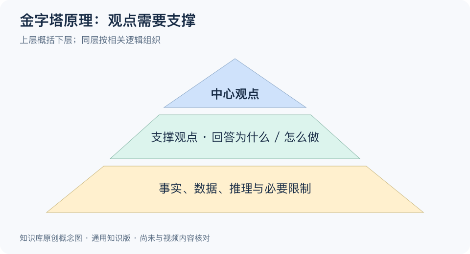

# 金字塔原理：一分钟看懂

> 基于通用知识整理，尚未与视频内容核对。文字来源见[明细](明细.md)。
> 内容类型：通用知识版

汇报了十分钟，对方仍问“所以你建议什么”，通常需要重新组织材料。金字塔原理用一个中心观点统领若干支撑观点，再由事实和推理支撑它们，让读者沿着层级理解你的判断。

记住四点：

- **先找读者的问题。** 对方要决定是否延期，你就围绕这个决定组织材料。
- **上层概括下层。** “有三个原因”只是路标；“当前验收证据不足，建议延期”才表达判断。
- **同层使用一致维度。** 原因与原因并列，步骤与步骤并列，避免混在一起。
- **底层提供依据。** 每个判断都应能追问到事实、假设或推理；结构整齐不等于结论正确。

最简步骤：写出问题，用一句话作答，列出支撑理由，把证据归到对应理由下，再检查是否重复或遗漏关键条件。发现证据撑不起原结论，就改结论，而不是勉强凑材料。

常见误区是每件事都硬凑三点，或把它当成只能先说答案的固定话术。探索新问题时可以先收集事实；面向读者呈现时，再按需要补背景和安排顺序。

[模型主页](README.md) · [明细](明细.md) · [案例](案例.md)
