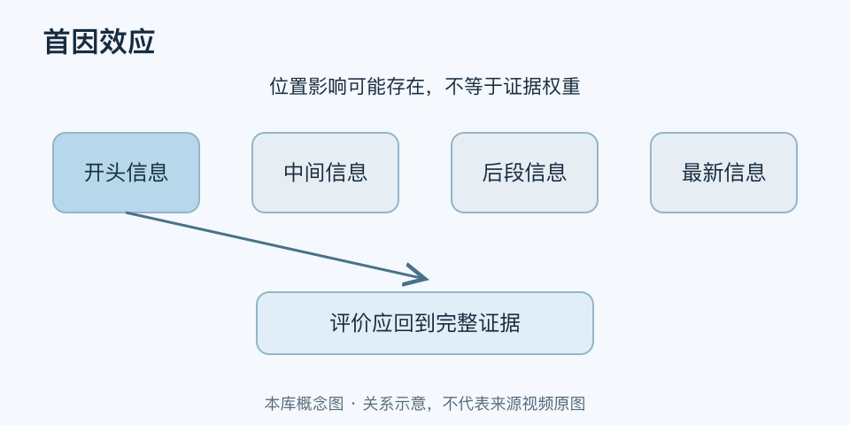

# 首因效应｜一分钟看懂

> 基于通用知识整理，尚未与视频内容核对。
> 内容类型：通用知识版

[返回主题](README.md) · [明细](明细.md) · [案例](案例.md)

介绍一位新人时，第一条信息可能成为理解后续行为的背景；背一串词时，开头部分也可能更容易被记住。首因效应指较早出现的信息对记忆或评价产生较大影响。本稿同时说明这两种常见语境，但不把它们当成完全相同的实验机制。

- 第一印象可以影响后续解释，但不是永远无法改变。
- 开头记得好，不代表中间内容不重要或不真实。
- 信息顺序、呈现方式与评价时点会影响结果。
- 应用时既要安排表达，也要防止先入为主造成不公。

最简用法：表达时先说目的和判断标准，再提供主要依据；评价人或方案时，先记录证据，等同类信息到齐后再比较。重要材料不只放在开头，也要给中间要点留下清晰结构与复习机会。

不要把“前三秒决定一生”当成定律，也不要用第一眼喜欢或不喜欢取代能力观察。若后来出现反证，应修改判断；为了维护最初印象而解释掉所有反证，已经偏离了理性使用这一模型的目的。
