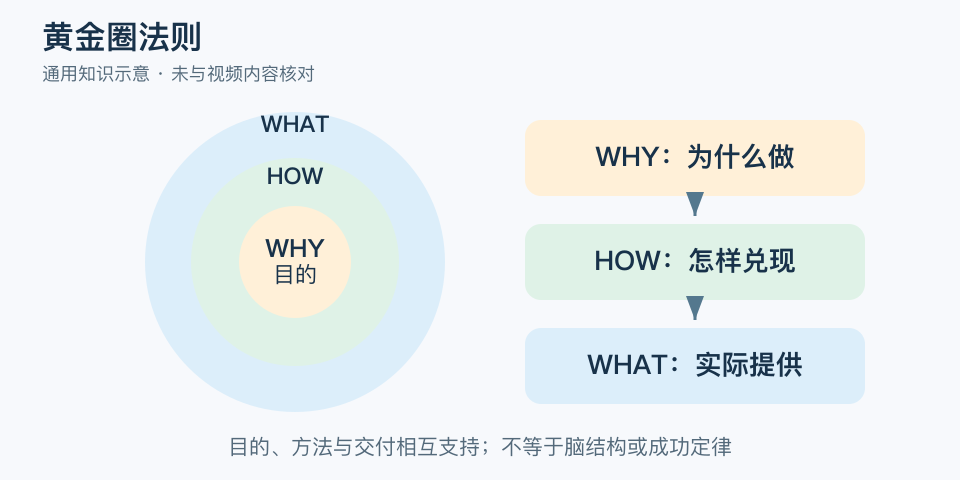

# 黄金圈法则：一分钟看懂

> 基于通用知识整理，尚未与视频内容核对。
> 内容类型：通用知识版

“我们开读书会”说清了活动，却没解释为什么值得参加。黄金圈是 Simon Sinek 提出的表达框架：先说明目的或信念，再说明实践方式，最后说明具体提供什么。本稿采用 WHY—HOW—WHAT 的通用版本。

- WHY 回答希望产生什么有意义的改变，不只是“赚钱”或“扩大规模”。
- HOW 是兑现目的的方法和原则，需要能落实到行为。
- WHAT 是产品、服务或行动，让人知道实际会发生什么。
- 三层必须相互支持，理念与实际体验矛盾会削弱表达。

最简应用：为一个项目各写一句为什么、怎样做、做什么，再用最近一次真实选择检查一致性。比如强调让新人敢提问，就应有低门槛提问机制，而非只有励志口号。

常见误区是认为所有沟通都必须先讲愿景。报故障、问价格、通知时间，读者往往先需要直接答案。黄金圈能帮助梳理意义，却不证明受众一定认同，也不能替代产品证据、交付能力或对真实需求的了解。不要把三个圆当作已证实的脑科学结构。

文字定义与适用边界参见[明细](明细.md)。

[模型主页](README.md) · [明细](明细.md) · [案例](案例.md)
