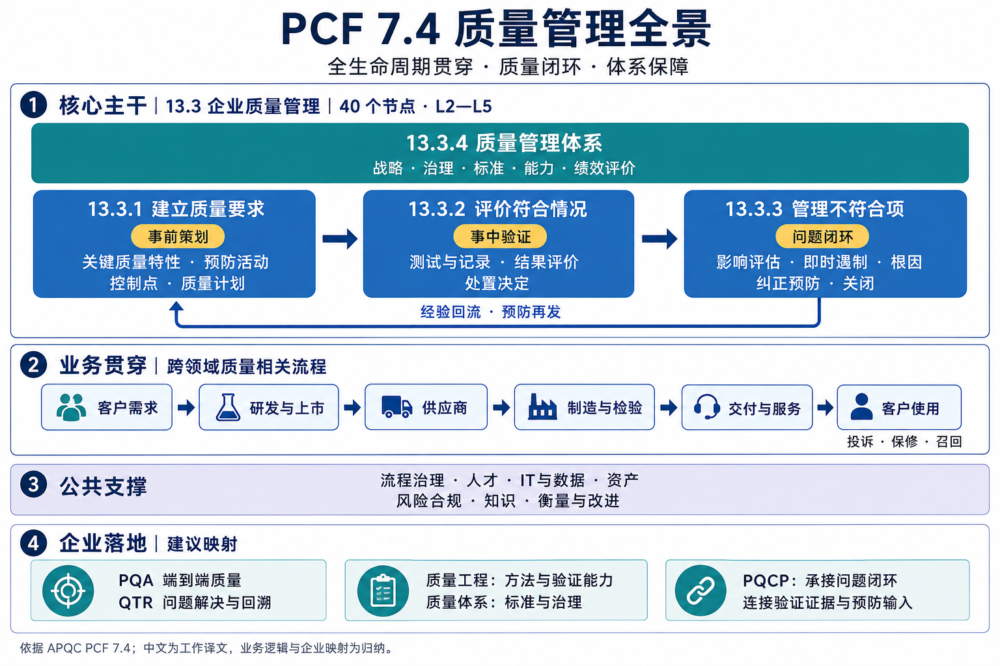
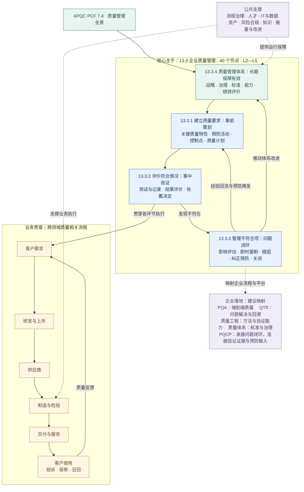

# 基于 APQC PCF 7.4 的质量管理全景汇总

> 编制日期：2026-09-08。标准基线：APQC Process Classification Framework®（PCF），Cross-Industry，Version 7.4，August 2024。
>
> 本文将“分类分级标准 PCF 7.4”理解为跨行业流程分类框架的 **7.4 版本**。项目中未发现另一份企业专用 PCF 7.4 标准。中文名称为工作译文；业务说明、产出、指标和 TQM/PQCP 映射为本文的应用解读。

## 一、汇报结论与范围

质量管理贯穿产品与服务全生命周期，以企业质量管理主干形成闭环，由公共能力支撑，并映射到现有 TQM / PQCP 业务体系。

### 1.1 汇报全景图



### 1.2 Mermaid 可编辑版



图中实线表示业务逻辑与反馈，虚线表示支撑或建议映射；箭头为本文归纳，不是 PCF 官方执行顺序。资产建设与维护质量、IT 质量的具体流程在后文展开。

**范围说明：**13.3 子树逐项完整；跨领域按端到端质量工作范围汇总。TQM/PQCP 为企业应用映射，不代表 APQC 官方组织划分或系统能力认证。PCF 是可裁剪的流程分类框架，企业岗位职责、行业要求和指标口径仍需结合实际定义。[来源：APQC 版本说明][official]

## 二、分类、层级与编号规则

### 2.1 PCF 的五级结构

| 层级 | PCF 层级名称 | 中文含义 | 质量管理示例 |
| --- | --- | --- | --- |
| L1 | Category | 流程类别 | 13.0 发展和管理业务能力（10013） |
| L2 | Process group | 流程组 | 13.3 企业质量管理（17471） |
| L3 | Process | 流程 | 13.3.1 建立质量要求（17472） |
| L4 | Activity | 活动 | 13.3.1.3 制定质量控制（17475） |
| L5 | Task | 任务 | 13.3.1.3.2 定义抽样方案（17477） |

`13.3.1.3.2` 是层级位置，`17477` 是 APQC 流程要素标识。做知识库时，应同时记录框架名称、版本、层级编号和 APQC ID，不能只用中文名称匹配。并非每条流程都必须分解到 L5。[来源：原版 PDF，第 3 页][pdf]

这里的 L1—L5 表示流程分解深度，不代表缺陷严重度、风险等级、成熟度或组织职级。企业的问题等级、风险优先级、升级时限应另设字典与规则。现有 TQM 的 `2.15.*` 编码与 PCF 的 `13.3.*` 是两套分类，应建立映射并保留各自层级。

### 2.2 核心主干概览

```text
L1 13.0 发展和管理业务能力（10013）
└─ L2 13.3 企业质量管理（17471）
   ├─ L3 13.3.1 建立质量要求（17472）
   ├─ L3 13.3.2 评价对要求的符合情况（17482）
   ├─ L3 13.3.3 管理不符合项（17492）
   └─ L3 13.3.4 实施和维护企业质量管理体系（17498）
```

下面各表的“工作说明／建议产出”为应用解读；编号、ID 与流程结构依据原版 PDF 第 32 页。EQMS 在这里指企业质量管理体系，涵盖治理、流程、人员和方法，其范围大于质量管理软件。[来源：13.3 原始条目][pdf]

## 三、13.3 企业质量管理完整清单

### 3.1 建立质量要求：13.3.1

目的：在设计、采购、生产和服务执行前，明确什么是合格、如何预防失效、如何检测，以及由谁完成。

| 层级 | PCF 编号 | APQC ID | 中文名称 | 工作说明／建议产出 |
| --- | --- | --- | --- | --- |
| L3 | 13.3.1 | 17472 | 建立质量要求 | 建立统一质量策划基线 |
| L4 | 13.3.1.1 | 17473 | 定义关键质量特性 | 将需求转为可评价的 CTQ；产出特性清单、限值与适用范围 |
| L4 | 13.3.1.2 | 17474 | 定义预防性质量活动 | 在问题发生前布置风险评估、预防与验证活动 |
| L4 | 13.3.1.3 | 17475 | 制定质量控制 | 建立覆盖对象、时点、方法、职责和异常反应的控制安排 |
| L5 | 13.3.1.3.1 | 17476 | 定义控制所在流程步骤或集成点 | 标明控制点及上下游接口 |
| L5 | 13.3.1.3.2 | 17477 | 定义抽样方案 | 明确抽样对象、频次、样本量与判定规则 |
| L5 | 13.3.1.3.3 | 17478 | 确定测量方法 | 明确量具、试验方法、测量条件与记录方式 |
| L5 | 13.3.1.3.4 | 17479 | 定义所需能力 | 明确执行与判定人员的知识、技能与授权要求 |
| L4 | 13.3.1.4 | 17480 | 证明评价符合性的能力 | 证明人员、方法、设备能够可靠判断要求是否满足；不等同于仅计算过程能力指数 |
| L4 | 13.3.1.5 | 17481 | 完成质量计划定稿 | 形成经确认、可执行、可变更追溯的质量计划 |

建议业务证据链：需求来源 → CTQ → 风险与预防安排 → 控制点 → 抽样与测量方法 → 能力证明 → 批准的质量计划。

### 3.2 评价对要求的符合情况：13.3.2

目的：依据质量计划执行验证，并把数据转成有依据的业务判断。

| 层级 | PCF 编号 | APQC ID | 中文名称 | 工作说明／建议产出 |
| --- | --- | --- | --- | --- |
| L3 | 13.3.2 | 17482 | 评价对要求的符合情况 | 形成质量执行结果及评价结论 |
| L4 | 13.3.2.1 | 17483 | 按质量计划开展测试 | 按规定范围和方法执行验证 |
| L5 | 13.3.2.1.1 | 17484 | 开展测试并采集数据 | 保存样本、对象、环境、设备与原始数据 |
| L5 | 13.3.2.1.2 | 17485 | 记录结果 | 保存实际值、限值、判定和证据版本 |
| L5 | 13.3.2.1.3 | 17486 | 确定结果的处置 | 根据结果确定接受、进一步调查或转交异常处理等安排 |
| L4 | 13.3.2.2 | 17487 | 评价测试结果 | 对结果的可信性与业务意义作综合判断 |
| L5 | 13.3.2.2.1 | 17488 | 评价样本的意义 | 判断样本对评价结论的代表性和支持程度 |
| L5 | 13.3.2.2.2 | 17489 | 汇总结果 | 形成质量结果报告及趋势视图 |
| L5 | 13.3.2.2.3 | 17490 | 提出行动建议 | 提出复测、改进或异常处置建议 |
| L5 | 13.3.2.2.4 | 17491 | 决定后续步骤 | 由有权人员决定下一步行动及责任 |

建议业务证据链：计划版本 → 执行记录 → 原始结果 → 样本评价 → 结果汇总 → 行动建议 → 决策记录。检验合格与批准放行的职责、权限应在企业流程中明确。

### 3.3 管理不符合项：13.3.3

目的：控制不符合造成的影响，消除根因，并形成关闭与预防再发的证据。

| 层级 | PCF 编号 | APQC ID | 中文名称 | 工作说明／建议产出 |
| --- | --- | --- | --- | --- |
| L3 | 13.3.3 | 17492 | 管理不符合项 | 建立发现、处置、分析、改进、关闭的闭环 |
| L4 | 13.3.3.1 | 17493 | 评估潜在影响 | 确认受影响产品、车辆、批次、客户及业务后果 |
| L4 | 13.3.3.2 | 17494 | 确定立即采取的措施 | 依据影响采取隔离、筛查、停止放行等即时控制 |
| L4 | 13.3.3.3 | 17495 | 识别根因 | 记录并验证原因，区分现象、假设和已证实根因 |
| L4 | 13.3.3.4 | 17496 | 采取纠正或预防措施 | 明确措施、责任、期限及效果验证安排 |
| L4 | 13.3.3.5 | 17497 | 关闭不符合项 | 确认处置和措施证据，完成关闭审批与知识回流 |

即时遏制、当前缺陷的纠正、消除根因的纠正措施应分别记录。本文建议将效果验证设为关闭条件；这是落地细化，不是新增一个 APQC 官方编号。8D、六步法、5 Why 等可作为执行方法映射到上述流程。

### 3.4 实施和维护企业质量管理体系：13.3.4

目的：让质量管理有战略、有流程、有资源、有独立反馈渠道，并持续有效运行。

| 层级 | PCF 编号 | APQC ID | 中文名称 | 工作说明／建议产出 |
| --- | --- | --- | --- | --- |
| L3 | 13.3.4 | 17498 | 实施和维护企业质量管理体系 | 建立跨部门的体系运行机制 |
| L4 | 13.3.4.1 | 17499 | 定义质量战略 | 明确质量方向、承诺与经营关联 |
| L4 | 13.3.4.2 | 17500 | 策划和部署体系范围、具体指标与总体目标 | 明确适用组织、产品、流程及分解目标 |
| L4 | 13.3.4.3 | 17501 | 识别体系核心流程、控制和指标 | 建立流程清单、控制矩阵及指标字典 |
| L4 | 13.3.4.4 | 17502 | 制定并记录体系政策、程序、标准和衡量方法 | 形成受控文件及变更记录 |
| L4 | 13.3.4.5 | 17503 | 评价体系绩效 | 评价执行效果、结果表现及改进需求 |
| L4 | 13.3.4.6 | 17504 | 建立体系改进的环境与能力 | 提供文化、人员、协作和方法保障 |
| L5 | 13.3.4.6.1 | 17505 | 奖励卓越质量表现 | 建立面向质量结果与正确行为的认可机制 |
| L5 | 13.3.4.6.2 | 17506 | 建立和维护质量伙伴关系 | 与供应商及其他协作方建立质量改进机制 |
| L5 | 13.3.4.6.3 | 17507 | 保持人员能力与胜任力 | 维护能力标准、培养计划和能力评价 |
| L5 | 13.3.4.6.4 | 17508 | 将体系信息融入沟通渠道 | 通过例会、培训和信息发布传递质量要求与体系进展 |
| L5 | 13.3.4.6.5 | 17509 | 确保独立的体系管理能直达组织适当权威层级 | 建立质量问题独立报告及升级渠道 |
| L5 | 13.3.4.6.6 | 17510 | 推广经验证的体系方法 | 将已验证做法转为标准、模板及可复用知识 |

### 3.5 完整性核对

| 子树 | 含本级的节点数 | L3 | L4 | L5 |
| --- | --- | --- | --- | --- |
| 13.3.1 | 10 | 1 | 5 | 4 |
| 13.3.2 | 10 | 1 | 2 | 7 |
| 13.3.3 | 6 | 1 | 5 | 0 |
| 13.3.4 | 13 | 1 | 6 | 6 |
| 合计，不含 13.3 | 39 | 4 | 18 | 17 |

加上 L2 的 `13.3（17471）`，共 40 个节点；上级 L1 `13.0` 不计入这 40 个节点。核对范围为原版 PDF 第 32 页，APQC ID 从 17471 至 17510。

## 四、贯穿业务生命周期的质量流程

以下“质量关注内容”为应用解读。编号与 ID 对应 PCF 7.4 原条目；一个单元格列出多个编号时，表示归并展示，不改变原标准父子关系。质量直接流程与上游输入、下游处置接口一并列示，避免只看 13.3 而遗漏现场执行。[来源：原版 PDF，第 4—15 页][pdf]

### 4.1 客户需求、研发与上市质量

| PCF 编号（APQC ID） | 标准条目中文名称 | 质量关注内容 |
| --- | --- | --- |
| 1.1.2（10018） | 调研市场并确定客户需求与期望 | 质量需求的业务来源 |
| 1.2.8（19959） | 制定客户体验战略 | 将客户体验目标转为质量策划输入 |
| 1.2.8.1.3（19963） | 对存在问题的客户体验开展根因分析 | 识别跨接触点的系统性体验问题 |
| 2.1.1.4（10073） | 策划和制定成本与质量目标 | 建立产品项目的质量目标及成本约束 |
| 2.1.2.5（11423）；2.1.2.5.5（11426） | 上市后评审；评审产品／服务质量与绩效 | 上市质量反馈和新项目经验输入 |
| 2.1.3.1（19941）；2.1.3.5（12771） | 开展强制及自愿评审；管理法规要求 | 纳入产品适用的评审与合规约束 |
| 2.1.4.4（11744）；2.1.4.5（11745） | 管理规格；管理图纸 | 保证质量判定引用正确版本 |
| 2.1.4.7（11747） | 开发和维护质量／检验文件 | 管理检验规范与质量文件 |
| 2.1.4.8（11748）；2.1.4.9（11749） | 维护过程规范数据；管理追溯数据 | 保持过程要求与产品履历的关联 |
| 2.2.3.1（11331） | 定义产品／服务要求 | 建立需求及质量要求基线 |
| 2.2.3.1.1—1.7（19991、16808、16809、16810、16811、16812、19992） | 基本功能、互操作性、安全、安保、法规、行业标准、用户体验要求 | 按适用性转化为特性、验证活动与证据要求 |
| 2.3.1.3（10085）；2.3.1.6（10086） | 开发设计规格；记录设计规格 | 形成受控设计输入与输出 |
| 2.3.1.5（16817） | 提供保修相关建议 | 将使用与保修经验反馈至设计 |
| 2.3.1.7（10087） | 开展强制及自愿外部评审 | 获取相应外部评价证据 |
| 2.3.1.8.1—8.4（16819—16822） | 面向制造、维修、再制造的设计及故障排查方法评审 | 提前考虑制造和全生命周期可维护性 |
| 2.3.1.10（10098） | 开发并测试原型生产／服务交付过程 | 识别过程可行性与质量风险 |
| 2.3.1.11（10089） | 消除质量与可靠性问题 | 开发阶段质量问题闭环 |
| 2.3.1.12（10090） | 开展内部产品／服务测试并评价可行性 | 设计验证与可行性证据 |
| 2.3.1.14（10092） | 与供应商和外部伙伴协同设计 | 对齐接口、零件和设计质量要求 |
| 2.3.2.2（10094）；2.3.2.4（10096） | 开展客户测试和访谈；最终确定技术要求 | 用客户验证完善需求基线 |
| 2.3.3.3（11418） | 提出工程／过程变更 | 将问题改进落实到受控变更 |
| 2.3.3.4（10100）；2.3.3.4.1（11417） | 安装并验证生产／服务交付过程；监控初始生产 | 验证量产或服务交付准备情况 |
| 2.3.3.5（19998） | 验证上市／启动程序 | 形成上市准备评价证据 |

上述流程可与企业 APQP、设计评审、FMEA、DVP、PPAP、质量门等方法建立映射。这些方法名称与企业阶段编码不是本表所列 PCF 原始子节点。

### 4.2 供应商、制造、仓储与追溯质量

| PCF 编号（APQC ID） | 标准条目中文名称 | 质量关注内容 |
| --- | --- | --- |
| 4.1.3.4（10245） | 监控物料规格 | 保证采购与生产采用一致要求 |
| 4.1.8（10368） | 制定质量标准和程序 | 生产供应链中的质量执行基线 |
| 4.1.8.1（10371） | 建立质量目标 | 将目标落实至供应链与生产 |
| 4.1.8.2（10372） | 制定标准测试程序 | 统一测试条件、方法和判定 |
| 4.1.8.3（10373） | 传达质量规格 | 确保相关执行方收到适用要求 |
| 4.2.1.2（10282） | 明确采购要求 | 将质量约束纳入采购输入 |
| 4.2.2.2（10289） | 认证和验证供应商 | 供应商质量能力准入 |
| 4.2.4（10280） | 管理供应商 | 供应商信息、绩效与协同管理 |
| 4.2.4.1（10299）；4.2.4.2（10300） | 监控／管理供应商信息；准备／分析采购与供应商绩效 | 形成质量绩效追踪的组织与数据接口 |
| 4.2.4.3（10301）；4.2.4.4（10302） | 支持库存和生产流程；监控交付产品质量 | 处理供货与生产接口，持续监测供货质量 |
| 4.3.1.5（10315）；4.3.1.6（10316） | 计划预防性维护；申请非计划维护 | 对接影响质量稳定性的设备维护 |
| 4.3.2.4（10313） | 重新加工缺陷品 | 将缺陷品处置关联到原问题和再验证 |
| 4.3.2.5（19566） | 监控并优化生产过程 | 识别过程偏移与异常信号 |
| 4.3.2.5.1—5.4（19567—19570） | 工厂自动化与控制、高级过程控制、实时优化、报警管理 | 将过程异常与质量控制联动 |
| 4.3.3（10369） | 执行质量测试 | 制造质量检验主流程 |
| 4.3.3.1（10318） | 校准测试设备 | 保证设备处于适用状态 |
| 4.3.3.2（10374） | 按标准测试程序执行测试 | 保证测试方法的一致性 |
| 4.3.3.3（20956） | 管理质量样本 | 样本标识、保存与使用追溯 |
| 4.3.3.4（10375） | 记录测试结果 | 保留原始质量证据 |
| 4.3.3.5（12045） | 跟踪并分析不符合趋势 | 发现重复和系统性质量问题 |
| 4.3.3.6（12046） | 开展根因分析 | 对接企业不符合项闭环 |
| 4.3.4（10370） | 维护生产记录并管理批次追溯 | 关联物料、批次、工序、设备与结果 |
| 4.3.4.1（10376）；4.3.4.2（10377） | 确定批次编号体系；确定批次使用 | 支撑影响范围识别和批次去向追溯 |
| 4.4.2.4（10352）；4.4.2.5（20109） | 管理退货流转；管理退货处置 | 退货收集、隔离、判定与后续处理 |
| 4.4.2.5.1（12708） | 确定受控零件质量 | 对退回零件形成质量判定 |
| 4.4.2.5.2—5.4（10366、21604、21605） | 回收利用、维修／翻新、返回成品库存 | 按判定执行处置并控制重新入库 |
| 4.4.3.2（10354） | 接收、检验和存储来货 | 收货检验与存储保护 |
| 4.4.3.6（10358）；4.4.4.2（10361） | 跟踪第三方仓储运输绩效；跟踪承运商交付绩效 | 识别仓储运输中的交付偏差和质量损失 |

关系说明：`13.3.2` 是跨企业的符合性评价能力，`4.3.3` 是制造现场测试流程；`13.3.3` 是企业不符合项管理，`4.3.3.6` 是制造场景的根因分析活动。可共享对象与证据，保留各自流程归属。

### 4.3 服务交付质量

| PCF 编号（APQC ID） | 标准条目中文名称 | 质量关注内容 |
| --- | --- | --- |
| 5.1.1.1（20028） | 建立和维护服务交付治理与管理体系 | 服务责任、标准与治理 |
| 5.1.1.2（20029）；5.1.1.4（20031） | 管理服务交付绩效；收集服务满意度反馈 | 服务质量目标与体验反馈 |
| 5.1.2.6（20038） | 评审并验证服务交付程序 | 保证服务流程可执行、可验证 |
| 5.2.3.6（20057）；5.2.3.7（12135） | 开展技能与能力测试；评价培训效果 | 服务人员能力验证 |
| 5.3.1.2（20061） | 理解客户要求并确定／完善实施方式 | 确认交付质量要求 |
| 5.3.2.3（20072） | 验证解决方案 | 在交付前形成验证证据 |
| 5.3.3.1（20078）；5.3.3.3（20080） | 交付／项目复盘并评价成功程度；确认按合同交付 | 服务验收与复盘 |
| 5.3.3.6（20083）；5.3.3.7（20084） | 沉淀知识；归档记录并更新系统 | 服务经验回流与证据保留 |

### 4.4 客诉、保修、售后、召回与客户评价

| PCF 编号（APQC ID） | 标准条目中文名称 | 质量关注内容 |
| --- | --- | --- |
| 6.1.1（20086）；6.1.5（10383） | 定义全企业客户服务要求；建立分客群目标服务水平 | 明确服务质量承诺 |
| 6.1.6（20089） | 定义保修索赔 | 建立政策、规则、职责与对客承诺 |
| 6.1.6.1—6.5（16893、16890、20090、20091、12673） | 保修政策、规则／索赔编码、供应商责任、保修服务、政策沟通 | 保修责任和判定依据 |
| 6.1.7（20092） | 制定召回战略 | 建立召回准备与处置原则 |
| 6.2.1.4（10393） | 监控并评价客服互动质量 | 对客服服务过程进行质量评价 |
| 6.2.2（10388） | 管理客户问题、请求和咨询 | 接收、分析、解决、回应问题；商机转交不纳入质量闭环 |
| 6.2.3（10389） | 管理客户投诉 | 投诉闭环主流程 |
| 6.2.3.1—3.5（10397、10398、10399、10400、19072） | 接收、分派、解决、回应、分析投诉及补救情况 | 形成从客户声音到改进的链路 |
| 6.2.4（20094）；6.2.4.1（10364）；6.2.4.2（20095） | 处理退货；授权退货；处理退货并记录原因 | 对接实物退货与问题证据 |
| 6.2.5（12840） | 向监管机构报告事件和风险 | 对接适用的外部事件报告流程 |
| 6.3.1（20605） | 登记产品 | 关联产品身份、客户和服务记录 |
| 6.3.2（12669） | 处理保修索赔 | 连接问题调查、责任判定与索赔处置 |
| 6.3.2.1（20096）；6.3.2.2（12671） | 接收索赔；验证索赔 | 验证索赔真实性及政策适用性 |
| 6.3.2.3（20097） | 调查保修问题 | 保修质量调查主活动 |
| 6.3.2.3.1—3.5（20098、12677、12678、20099、20100） | 定义问题、安排现场服务、获取故障件、根因分析、接收调查结论与纠正建议 | 建立故障件—根因—措施的证据链 |
| 6.3.2.4—2.10（20101、20102、12668、20103、20104、20105、12667） | 责任判定、预授权、审批、通知、支付授权、关闭、核对保修交易处置 | 索赔行政与财务接口；索赔关闭不自动等于质量问题关闭 |
| 6.3.3（20106）；6.3.3.1（20107）；6.3.3.2（20108） | 管理供应商追偿；建立追偿请求；协商追偿 | 质量责任及损失回收 |
| 6.3.4.3.2（10331） | 执行产品维修 | 保存维修过程与结果证据 |
| 6.3.4.4（10323） | 保证服务质量 | 维修服务质量确认 |
| 6.3.4.4.1—4.4（10334—10337） | 识别已完成工单、识别未完成与失败工单、收集反馈、处理反馈 | 评价维修完成情况和客户体验 |
| 6.4（20110） | 管理产品召回和监管审核 | 召回业务主流程 |
| 6.4.1（20111） | 启动召回 | 形成召回启动记录 |
| 6.4.2（20112） | 评价危害发生的可能性和后果 | 支撑风险与范围判断 |
| 6.4.3（20113） | 管理召回沟通 | 管理相关方通知及进展沟通 |
| 6.4.4（20114） | 提交监管报告 | 留存提交与反馈证据 |
| 6.4.5（20115） | 监控并审核召回有效性 | 跟踪处置进度和实际效果 |
| 6.4.6（20116） | 管理召回终止 | 形成结束条件与批准记录 |
| 6.5（20595） | 评价客户服务运营和客户满意度 | 客户结果评价主流程 |
| 6.5.1（10401） | 衡量对问题、请求和咨询处理的满意度 | 收集反馈、分析改进机会、反馈产品管理 |
| 6.5.2（10402） | 衡量对投诉处理和解决的满意度 | 收集反馈、分析投诉数据、识别共性投诉 |
| 6.5.3（10403） | 衡量对产品和服务的满意度 | 售后与跨渠道反馈、满意度分析、反馈研发和制造；广告效果反馈仅按适用性关联 |
| 6.5.4（12672） | 评价和管理保修绩效 | 满意度、保修指标、改进机会、减少浪费、欺诈索赔调查 |
| 6.5.5（20121） | 评价召回绩效 | 将召回结果纳入持续改进 |

### 4.5 资产建设与维护质量

质量控制还直接出现在资产建设与维护环节，不能只统计产品制造和售后流程。[来源：原版 PDF，第 27 页][pdf]

| PCF 编号（APQC ID） | 标准条目中文名称 | 质量关注内容 |
| --- | --- | --- |
| 10.2.4.2（19226） | 实施建设质量控制 | 对建设过程和结果进行控制，关联检查与验收证据 |
| 10.3.2.3（19248） | 实施质量控制 | 对资产维护作业质量进行控制，关联维护后的验证证据 |

## 五、质量管理的公共支撑能力

公共支撑流程有自身的业务归属。质量管理通过需求、控制、证据和指标与之协同；不能据此认定所有 IT、财务、人力或合规工作都由质量部门负责。

| 支撑主题 | PCF 关联 | 面向质量的应用解读 |
| --- | --- | --- |
| 流程治理 | 13.1（16378），尤其 13.1.1—13.1.4 | 建立流程责任人、分类框架、控制点、文件和绩效报告 |
| 持续改进 | 13.1.5（21453），下含 13.1.5.1—5.4（16397、11138、16398、16399） | 识别机会、选择方法、管理改进项目、持续执行改进 |
| 项目管理 | 13.2.3（16410） | 为质量专项配置范围、资源、里程碑和效果复盘 |
| 变更管理 | 13.4（11074） | 将纠正措施落实到流程、组织、培训与变更后的效果监测 |
| 知识管理 | 13.5（11073） | 沉淀失效模式、根因、有效措施及适用条件，确保可检索与可复用 |
| 衡量与对标 | 13.6（21584） | 统一指标、评价绩效、开展内外部对标和差距分析 |
| 业务分析 | 13.7（20959） | 数据采集准备、分析建模、结果报告及补救行动识别，为质量分析提供通用能力 |
| 人才能力 | 7.1.4（17046）；13.3.1.3.4（17479）；13.3.4.6.3（17507） | 连接企业能力模型与检验、审核、分析等质量岗位能力 |
| 数据与信息 | 8.4.2.4（20774）；8.4.3.1（20777）；8.4.4.1（20780） | 数据权责、信息规范和监控；可用于质量数据治理，不杜撰独立的“数据质量管理”原节点 |
| IT 开发与测试 | 8.5.4（20808）；8.5.5（20817） | 质量平台的软件测试、维护验证和异常控制 |
| 设备与资产 | 10.0（10010）；4.3.3.1（10318） | 设备维护、试验设施和计量校准与质量结果关联 |
| 风险治理 | 11.1（17060），尤其 11.1.3（17462） | 将质量风险纳入企业风险识别、评价、缓解与监测 |
| 内部审核 | 11.2.1.3（14133） | 作为企业内审接口；质量体系审核方案应按适用要求具体定义 |
| 法规合规 | 11.2.2（16463） | 识别适用要求、监测变化、评价差距、建立控制和报告 |
| 整改与韧性 | 11.3（11185）；11.4（11216） | 对接重大质量事件的跨部门整改与业务连续性 |
| 外部关系 | 12.2（11011） | 对接监管、行业机构与外部审核沟通 |
| 质量成本 | 9.0（10009）与 13.6（21584） | 将预防、鉴定、内部失败、外部失败等成本作为企业指标维度；本文未将该划分声称为 PCF 单独流程 |

来源：原版 PDF 第 16—33 页；上述用途为本文关联解读。[查看原版框架][pdf]

### 5.1 IT 质量与数字化平台保障

IT 自身也有服务质量、设计符合性、测试、变更验证与运行改进活动。对质量数字化平台而言，下列流程同时是平台可靠运行的保障；不应把“有问题管理软件”等同于“质量体系已经有效”。[来源：原版 PDF，第 18—22 页][pdf]

| PCF 编号（APQC ID） | 标准内容中文概括 | 质量应用 |
| --- | --- | --- |
| 8.1.5（20632） | 制定并管理 IT 服务水平 | 明确服务要求和服务水平约定 |
| 8.1.7（20648） | 评价服务交付绩效并传达业务价值 | 评价服务符合性、反馈和改进效果 |
| 8.2.5.2（20684） | 定义 IT 控制点与保证程序的治理模型 | 确立控制与保证机制 |
| 8.5.3.7（20806） | 评价 IT 服务／解决方案架构符合性 | 控制设计偏离和架构例外 |
| 8.5.4.1.1（20810） | 验证需求 | 确认开发输入满足业务需要 |
| 8.5.4.1.3（20812） | 测试 IT 服务／解决方案组件 | 建立组件层的测试证据 |
| 8.5.4.1.5（20814） | 验证 IT 服务／解决方案 | 验证整体方案是否符合要求 |
| 8.5.4.1.7（20816） | 管理服务／解决方案过程例外 | 对异常建立记录和处置 |
| 8.5.5（20817） | 执行服务／解决方案维护与测试 | 修复后的验证与回归 |
| 8.6.2.4（20836） | 规划并协调用户测试与资源 | 组织用户验收所需工作 |
| 8.6.3.2（20842）；8.6.3.6（20846） | 确认变更／发布符合性；批准部署 | 建立发布质量判定与授权记录 |
| 8.6.4.6（20854）；8.6.4.8（20856） | 开展安装后测试；确认变更／发布实施成功 | 验证部署后的实际运行结果 |
| 8.7.5.10（20904）；8.7.6.4（20909）；8.7.8.5（20927） | 服务支持绩效、基础设施性能与容量、问题解决 | 把运行问题与改进联动 |

### 5.2 改进闭环与相邻审核边界

`13.1.3.3（21452）` 识别流程控制点，`13.1.4（16392）` 管理流程绩效，`13.1.5（21453）` 推进改进，`13.4.4（11137）` 保持改进成果，`13.5` 沉淀知识，`13.6` 衡量与对标，共同支持质量从发现差距到标准更新的闭环。

EHS 审核 `13.8.1.2（11187）`、危险物合规审核 `10.4.11.4（12183）` 和 IT 合规审核 `8.3.6.2（20745）` 属于相邻专业领域。企业采用一体化管理体系时可协同审核，但本文不将这些领域的全部职责并入质量管理。

## 六、与现有 TQM / PQCP 的映射建议

依据项目中的 [TQM 总体本体模型](./TQM-总体本体模型.md)、[TQM 质量价值流](./TQM-质量价值流.md) 和 [PQCP 本体知识库总结汇报大纲](./PQCP本体知识库总结汇报大纲.md)，建议采用以下多对多映射。映射仅用于梳理覆盖范围，不代表已核验系统实现。

| 企业领域 | PCF 主关联 | 在企业中的承接重点 |
| --- | --- | --- |
| 2.15.1 PQA 产品端到端质量 | 13.3.1、13.3.2，及 2.0、4.0、5.0、6.0 的相关流程 | 需求、质量目标、计划、阶段验证、质量门及生命周期反馈 |
| 2.15.2 QTR 问题解决及回溯 | 13.3.3，及 4.3.3.5—3.6、6.2.3、6.3.2.3、6.4、13.5 | 问题、影响评估、遏制、根因、措施、验证、关闭和回溯 |
| 2.15.3 质量工程 | 13.3.1.3—1.4、4.3.3、13.1.5、13.6 | 方法、测量与试验能力、分析工具、过程改善及指标体系 |
| 2.15.4 质量体系 | 13.3.4，及 11.2、13.1、13.4 | 战略、标准、文件、审核接口、治理与持续改进 |
| PQCP 质量问题平台 | 优先关联 13.3.3，并连接 13.3.2 的结果和 13.3.1 的预防输入 | 统一问题身份、流程、关联零件／车辆、行动、证据与权限 |

PQCP 的问题流转能力是全面质量管理的一部分。仅凭当前问题管理资料，不能判定企业已具备完整 EQMS、计量实验室管理、供应商准入、制造检验或保修召回能力。

### 6.1 建议统一的业务对象

| 对象组 | 建议对象 | 关键关系 |
| --- | --- | --- |
| 策划 | 质量要求、CTQ、质量目标、质量计划、控制点 | 要求分解为特性，特性由计划和控制覆盖 |
| 验证 | 抽样方案、测量方法、测试执行、测试结果、质量证据 | 结果引用计划、方法、对象和版本 |
| 处置 | 评价结论、处置决定、质量门决定 | 决定引用结果、条件、批准人和权限 |
| 问题 | 不符合项、客户投诉、保修问题、现场事件 | 多来源可以关联同一根本问题，保留各自业务身份 |
| 闭环 | 影响评估、遏制措施、根因、纠正预防措施、有效性验证、关闭记录 | 措施作用于原因，关闭依赖验证和审批证据 |
| 追溯 | 产品、车辆、零件、供应商、批次、工序、设备、软件版本 | 连接问题发生位置、影响范围和整改对象 |
| 治理 | 质量标准、流程、岗位能力、审核发现、指标、经验 | 标准指导执行，经验反向更新计划与控制 |

### 6.2 分类分级应保存的字段

建议每个流程条目保存：`框架名称、框架版本、PCF层级编号、APQC ID、层级、父级编号、中文名称、原文名称、来源页码、企业流程编码、责任人、输入、输出、控制、指标、系统、证据、映射依据`。

质量问题另存：`问题类型、业务领域、来源、生命周期阶段、严重度、发生频度、可探测性、影响范围、处置优先级、升级规则、当前状态`。这些问题分类分级规则需要企业定义，不从 PCF L1—L5 自动推导。

## 七、指标与汇报口径建议

以下为企业落地建议，**不是 PCF 7.4 PDF 发布的标准指标公式或对标值**。上线前需明确分母、对象、时间窗口、来源系统及责任人。

| 管理目标 | 建议指标 | 口径要点 |
| --- | --- | --- |
| 策划完整 | CTQ 控制覆盖率 | 已有有效控制的 CTQ 数／适用 CTQ 总数；定义“有效”及适用范围 |
| 按计划验证 | 到期验证完成率 | 已完成到期验证项／应完成验证项；延期批准项单独标注 |
| 过程稳定 | 一次合格率、过程能力指标 | 明确工序、产品组合、返工是否排除；能力指数需先确认统计适用条件 |
| 供应质量 | 供应商不良率 | 明确按件、批次或缺陷计数，避免不同分母混用 |
| 及时控制 | 遏制及时率、遏制耗时 | 以确认发现时点至有效实施时点计时 |
| 闭环质量 | 按期关闭率、措施有效率、问题再发率 | 关闭需满足验证条件；再发需定义相同根因与观察窗口 |
| 客户结果 | 客诉率、保修故障率、维修后重复故障率 | 按销售／在用规模、暴露时间和车型群组归一化 |
| 召回效果 | 完成率、处置后有效性 | 分别评价覆盖进度与问题消除效果 |
| 体系运行 | 审核整改有效率、能力达标率 | 避免只统计培训人次或文件数量 |
| 经营价值 | 质量损失成本、改进收益 | 区分实际损失、预计风险和已确认收益，避免重复计算 |

管理层汇报建议按“质量目标与结果 → 生命周期重点问题 → 重大风险与闭环 → 体系能力缺口 → 下一阶段措施与资源”展开；每项结论附数据口径和证据，不以活动数量代替业务效果。

## 八、来源与使用说明

1. [APQC 官方 PCF 7.4 资源页][official]：核对版本、发布日期及跨行业适用范围。
2. [APQC PCF 7.4 原版 PDF（IFRC 站点托管）][pdf]：APQC 原始文件；第 2 页为授权与署名，第 3 页为层级及编号，第 6—15 页为主要业务质量相关流程，第 32 页为完整 13.3，第 31—33 页为流程治理、改进、知识和衡量支撑。
3. 本项目现有 TQM/PQCP 文档：仅作为企业映射的输入，未据此断言实际系统已完成全部能力。

本文件基于 PCF 原版第 2 页明确允许使用、复制、发布、修改和创作衍生作品的授权编制，并保留以下要求的署名。工作译文和企业映射由本文编制者负责，不代表 APQC 官方中文译本。

> APQC’s Process Classification Framework® (PCF) is an open standard developed by APQC, a nonprofit that promotes benchmarking and best practices worldwide. The PCF is intended to facilitate organizational improvement through process management and benchmarking, regardless of industry, size, or geography. To download the full PCF or industry-specific versions of the PCF, as well as associated measures and benchmarking, please visit www.apqc.org/pcf.

[official]: https://www.apqc.org/resource-library/resource-listing/apqc-process-classification-framework-pcf-cross-industry-pdf-12
[pdf]: https://solutions.ifrc.org/sites/default/files/2024-10/K014750_APQC%20Process%20Classification%20Framework%20%28PCF%29%20-%20Cross%20Industry%20-%20PDF%20Version%207.4.pdf
