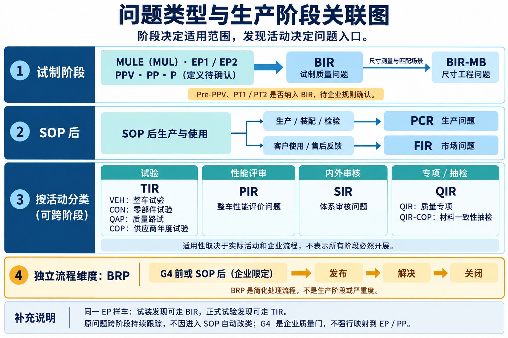

# 汽车质量问题分类与角色职责

整理日期：2026-09-08

本文整理问题类型、生产阶段关联、分类边界及 VSE／DRE 角色职责。类型代码和部门分工沿用用户提供的企业口径，通用语义与待确认项分别说明。

试制定义、阶段数量、具体动作与产出见[车辆试制与生产阶段详解](./车辆试制与生产阶段详解.md)。

## 1. 问题分类与管理语义

> **理想汽车阶段差异（用户于 2026-09-08 确认）：使用 PPV1、PPV2、PPV3，不使用 PT1／PT2。下图保留跨企业参考表达；其中 PT1／PT2 相关待确认提示不适用于理想汽车，PPV 应按实际轮次记录。**

> **工厂端边界：理想汽车从 Pre-PPV 开始，后续造车／生产阶段均在工厂端开展。** 工厂端不等于制造根因或制造部门独自整改；应按发现活动选择问题入口，并按根因确定责任。下图不表达场地边界，具体见[试制文档第 2.3 节](./车辆试制与生产阶段详解.md#23-理想汽车执行场地边界pre-ppv-起在工厂端)。

*图：基于本文企业口径的关联示意。箭头表示适用或分类关系，不表示问题流转顺序；BIR-MB 是尺寸工程分类，非所有 BIR 的必经步骤。TIR、PIR、SIR、QIR 按实际发现活动选择；BRP 单独表示简化流程。*

### 1.1 口径说明

试制分为**研发样车试制**和**生产线试制**：本文将 MUL／EP1／EP2 归入研发样车试制，理想汽车从 Pre-PPV 起进入工厂端生产线试制，使用 PPV1／PPV2／PPV3 记录相应轮次。两类试制均可能按发现活动产生 BIR 或 TIR，不能将 BIR 仅理解为研发端问题，也不能将生产线试制问题全部归为 SOP 后的 PCR。具体分类及阶段边界见[车辆试制与生产阶段详解](./车辆试制与生产阶段详解.md)。

下表以用户提供的类型代码、中文含义、阶段限制和管理部门为企业口径，补充通用的问题管理语义、触发场景及示例。**这些缩写及组织分工不是全行业统一标准**；不根据字母猜测其英文全称。

“问题管理部门”承担流程管理、协调、跟踪等职责，不等于根因责任部门或实际整改部门。后两者应在分析后确定。PTC、VAC、MB、QAP 等企业代码的正式全称，以及 G4 的具体里程碑定义，仍需企业术语表确认。

### 1.2 分类表

| 类型 | 中文含义与通用业务语义 | 触发场景／适用阶段 | 典型问题示例（业务举例） | 问题管理部门（沿用用户口径） |
|---|---|---|---|---|
| BIR | 试制质量问题报告；管理样车制造、装配、调试及试制检查暴露的产品与制造问题 | PPV／PP／P／MULE／EP 阶段发现；理想汽车 PPV 按 PPV1／PPV2／PPV3 记录，具体覆盖范围按企业规则 | 零件装不上、装配干涉、线束长度不足、密封不良、试制上电异常 | 研发效能与质量-试制 / 质量安全-投产 |
| BIR-MB | 试制阶段尺寸工程类问题；聚焦尺寸偏差、几何匹配和公差配合 | 试制尺寸测量、车身及内外饰匹配检查 | 白车身定位孔超差、车门间隙面差不合格、尺寸链累积导致装配偏移 | 质量安全 |
| TIR-VEH | 整车试验问题报告；记录整车验证中出现的失效或不满足试验要求的结果 | 整车性能、耐久、环境适应性等试验 | 高温动力受限、耐久后结构开裂、低温启动失败 | 研发效能与质量 / 质量安全 / PTC；具体分工待确认 |
| TIR-CON | 零部件试验问题报告；记录零件、总成或系统级验证异常 | 台架、实验室及零部件验证试验 | 电机耐久失效、连接器振动后接触不良、密封件老化后泄漏 | 研发效能与质量 / 质量安全 / PTC；具体分工待确认 |
| TIR-QAP | 质量路试问题报告；聚焦质量路试过程中暴露的整车质量缺陷 | 按质量路试计划开展的车辆检查与道路运行 | 异响、跑偏、颠簸路面功能间歇失效 | 研发效能与质量 / 质量安全 / PTC；具体分工待确认 |
| TIR-COP | 供应商年度试验问题报告；按用户口径承接年度或周期性再验证异常 | 供应商年度试验或规定的周期性验证 | 年度耐久试验失败、周期性性能试验不达标 | 研发效能与质量 / 质量安全 / PTC；具体分工待确认 |
| PIR | 整车性能问题报告；承接性能评审、评价中发现的目标差距或体验问题 | 整车性能评审、主客观评价 | 加速响应迟滞、制动脚感不佳、转向回正不足、舒适性未达到项目目标 | 研发效能与质量 |
| FIR | 售后市场问题报告；管理车辆进入市场后由客户使用、维修服务等渠道反馈的问题 | 客户投诉、服务站维修、保修和市场质量反馈 | 用户报无法充电、重复故障灯、使用一段时间后出现渗漏 | 质量安全 |
| PCR | 问题交流报告；按用户口径管理 SOP 后生产过程中发现的问题 | SOP 后制造、装配、检验和下线检查等生产活动；与专项入口重叠时按企业路由规则处理 | 漏装错装、拧紧不合格、焊接缺陷、下线检测失败、批次零件异常 | 质量安全 |
| BRP | 简要处理流程；属于处理流程简化方式，语义上与按来源划分的问题类别不同 | 用户口径为 G4 前／SOP 后专用，仅“发布—解决—关闭”三步 | 对策明确、处置和验证能够在简化流程中完整留痕的问题；准入条件待确认 | 研发效能与质量 / 制造质量 |
| SIR | 体系内／外审核问题；承接审核发现的不符合项及其纠正措施 | 内部审核、外部审核；是否包括过程／产品审核按企业规则 | 未按规定执行变更审批、关键记录缺失、规定的检验控制未实施 | 发现部门 / 质量体系 |
| QIR | 质量专项问题；承接跨车型、跨部门或共性问题的专项治理 | 专项检查、趋势分析、重复问题升级、管理专项 | 多车型同类渗漏、同一供应商批次缺陷、反复发生的问题需集中攻关 | 质量安全 / 研发效能与质量（G4前）/ VAC；具体分工待确认 |
| QIR-COP | 材料一致性抽检问题；关注抽样材料与规定材料要求、认可基准的一致性 | 材料一致性抽检或相关专项检查 | 材料成分、牌号或性能与认可要求不符，如硬度、拉伸性能不达标 | 质量安全 / 研发效能与质量（G4前）/ VAC；具体分工待确认 |

### 1.3 容易混淆的分类边界

| 易混淆类型 | 建议区分方式 |
|---|---|
| BIR 与 TIR | 优先看发现活动：试制造车、装配和调试发现的问题通常走 BIR；按正式试验任务执行时发现的问题通常走 TIR。同一台 EP 样车可以产生不同类别的问题。 |
| BIR 与 BIR-MB | 尺寸测量、几何匹配和公差链问题优先考虑尺寸工程子类；不能只因“装不上”就直接认定为尺寸问题。 |
| TIR-VEH 与 PIR | 正式试验任务与判定结果通常归 TIR；性能评审或评价中的目标差距通常归 PIR。对同一事实应关联既有问题，避免重复统计。 |
| FIR 与 PCR | 客户使用和售后服务渠道发现的归市场问题；工厂生产和检验发现的归生产问题。二者均可能发生在 SOP 后，不能仅按日期区分。 |
| TIR-COP 与 QIR-COP | 按用户定义，前者重点是供应商年度试验，后者重点是材料一致性抽检；若一次年度试验同时包含材料抽检，应按任务来源及企业规则选择主入口并关联。 |
| SIR 与产品问题 | 审核不符合项指向流程或体系要求；审核同时发现具体产品缺陷时，需关联产品问题及受影响批次，分别跟踪体系整改和产品处置。 |
| QIR 与其他来源问题 | 专项可能汇总多个 BIR、TIR、FIR 或 PCR。建议保留原始问题及来源，通过专项关联管理，避免将汇总关系误算为新增缺陷。 |
| BRP 与其他类型 | BRP 表示简化工作流，不是根因类别或严重度等级；三步状态仍应保留必要的处置、验证和关闭证据。 |

以上为建议的判别逻辑，不替代企业系统已有的分类优先级。不能因为进入 SOP 就把既有 BIR 自动改成 PCR，也不能仅凭发现阶段认定根因属于研发、制造或供应商。

### 1.4 建议独立记录的字段

这套类型同时混合了发现来源、专业领域和处理方式。用于问题系统或本体建模时，建议保留现有代码，同时独立记录以下维度：

| 维度 | 示例 | 作用 |
|---|---|---|
| 报告类型 | BIR、TIR-VEH、FIR、PCR | 兼容现有流程入口 |
| 发现阶段 | 理想汽车示例：EP1、PPV1、PPV2、PPV3、SOP 后；其他企业可有 PT1／PT2 | 记录实际发现阶段；按企业及流程版本维护阶段字典，PPV 汇总项与轮次不重复计数 |
| 执行场地／发现地点 | 工厂、试验场、实验室、售后服务站等 | 理想汽车 Pre-PPV 起的造车／生产活动在工厂端；具体问题发现地点另行记录，不以场地推定整改责任 |
| 发现活动 | 试装、正式试验、评审、路试、售后、审核、抽检 | 支撑分类判断和来源分析 |
| 专业领域 | 尺寸、材料、电气、性能、制造工艺、体系 | 区分问题专业属性 |
| 问题对象与证据 | 车辆、零件、批次、软件版本、试验报告、测量记录 | 支撑复现、影响范围和追溯 |
| 严重度与影响范围 | 安全风险、功能影响、涉及车辆或批次 | 独立评价风险，不由报告类型替代 |
| 根因类别 | 设计、制造、供应商、软件、流程等 | 经分析确认，避免按入口预判根因 |
| 组织职责 | 管理部门、整改责任部门、验证人、关闭批准人 | 区分协调、解决、验证和批准 |
| 处理流程 | 标准闭环、BRP 简化流程 | 区分处理方式与问题来源 |
| 关联关系 | 重复问题、同根因问题、专项汇总、跨阶段延续 | 支撑复用和去重统计 |

COP 在车辆认证领域通常指 Conformity of Production（生产一致性），其含义不只限于材料抽检或年度试验；这一通用用法不能直接证明 TIR-COP、QIR-COP 的企业英文全称或覆盖范围。[来源 1]

本节仍待确认：各代码正式全称、PTC／VAC 职责、G4 定义、BRP 准入及升级条件、理想汽车 PPV 各轮的问题路由细则（PT 阶段不适用）、SIR 审核范围，以及同一问题多入口时的主记录规则。

## 2. 质量问题处理中的 VSE 与 DRE

### 2.1 定义与职责

在汽车研发与质量问题管理语境中，VSE 和 DRE 通常是工程岗位角色。通用汽车官方岗位说明采用以下英文定义，并分别强调系统集成、跨部门协调，以及设计发布、验证计划、工程变更和问题解决。[来源 3、4]

| 缩写 | 常见英文全称 | 中文理解 | 核心职责 |
|---|---|---|---|
| VSE | Vehicle Systems Engineer | 车辆系统工程师，偏系统集成与技术协调 | 协调多个零部件和子系统，处理接口、性能及方案冲突，推动系统满足整车质量、进度、成本等目标 |
| DRE | Design Release Engineer | 设计发布工程师，常承担零部件／子系统设计责任 | 负责具体产品的设计开发、技术要求、设计发布、工程变更和技术问题整改 |

**VSE 偏系统整体协调，DRE 偏具体产品技术落实。** 两者通常属于研发工程角色，不一定隶属质量部门；VSE 也不一定是 DRE 的行政上级。企业内部的中文职位名称、职责范围和授权关系，以实际组织及流程规定为准。

### 2.2 质量问题处理职责对照

下表是典型协作方式的业务归纳，不代表任何企业固定的审批矩阵。

| 工作环节 | VSE 的典型作用 | DRE 的典型作用 |
|---|---|---|
| 问题分解 | 判断涉及哪些系统，协调技术责任边界 | 分析所负责零件或子系统的问题 |
| 根因分析 | 推动跨系统联合分析，识别接口影响 | 分析设计、材料、结构、参数等具体原因 |
| 制订对策 | 协调方案取舍，评估对整车和其他系统的影响 | 提出技术整改方案，推动供应商及相关专业实施 |
| 工程变更 | 协调关联系统、项目进度和实施条件 | 更新相关图纸、技术要求及设计发布资料 |
| 验证与关闭 | 推动系统集成效果确认和跨部门问题收敛 | 提交整改证据，配合零件及整车复验 |

问题管理部门、技术整改责任人、验证人和关闭批准人应分别记录，不能只凭 VSE 或 DRE 头衔推定最终关闭权限。

### 2.3 示例：EP2 样车车门漏水

- **DRE：** 负责密封条或相关零件的工程师分析截面、压缩量和安装结构，提出具体修改方案。
- **VSE：** 协调车门、车身、密封等专业，检查修改是否影响关门力、风噪和尺寸匹配。
- **质量／试验人员：** 按职责跟踪问题、组织或执行复验，确认结果满足关闭要求。

上述示例用于说明协作关系，不预设漏水一定由设计引起。若根因属于制造偏差或供应商质量，仍应由相应责任方实施整改，研发角色配合技术分析及影响评估。

## 参考来源

资料核对日期：2026-09-08。岗位来源支持角色定义，职责对照和示例为业务归纳。

1. [英国车辆认证机构 VCA：Conformity of Production](https://www.vehicle-certification-agency.gov.uk/conformity-of-production/) — COP 在车辆认证领域的通用语义，不用于证明本文企业问题代码的定义。
2. 用户于 2026-09-08 提供的问题分类表 — 第 1 节类型代码、中文含义、管理部门及 G4／SOP 阶段限制的直接来源；典型场景、示例和建模建议为补充归纳。
3. [GM：Vehicle Systems Engineer — Chassis, Thermal and Propulsion Integration](https://generalmotors.wd5.myworkdayjobs.com/Careers_GM/job/Warren-Michigan-United-States-of-America/Vehicle-Systems-Engineer---Chassis--Thermal-and-Propulsion-Integration--CTPI-_JR-202607697-1) — VSE 英文定义、系统集成与跨部门协调职责。
4. [GM：Design Release Engineer（DRE）— Customer Controls](https://search-careers.gm.com/en/jobs/jr-202612821/design-release-engineer-dre-customer-controls/) — DRE 英文定义、设计发布、工程变更、验证计划及试验／制造／市场问题解决职责。
5. 用户于 2026-09-08 补充的理想汽车口径 — 理想汽车不使用 PT1／PT2，使用 PPV1／PPV2／PPV3。
6. 用户于 2026-09-08 补充的执行场地口径 — Pre-PPV 起的后续造车／生产阶段均在工厂端开展。
