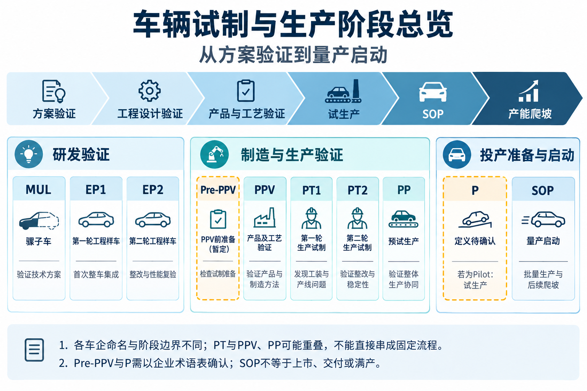

# 车辆试制与生产阶段详解



*图：跨企业阶段分组参考，图中 PT1／PT2 不适用于理想汽车。理想汽车使用 PPV1／PPV2／PPV3，详见第 2.2 节；两套代号不能直接一一对应。Pre-PPV 与 P 的定义待确认。*

整理日期：2026-09-08  
覆盖代号：MUL、EP1、EP2、Pre-PPV、PPV、PP、P、SOP；补充理想汽车 PPV1／PPV2／PPV3，保留其他企业 PT1／PT2 作为对照。

> **理想汽车口径（用户于 2026-09-08 确认）：没有 PT1、PT2，使用 PPV1、PPV2、PPV3 表示。本文不将 PT1／PT2 列入理想汽车阶段，也不将两套代号作一一等价映射。**

> **执行场地边界：从 Pre-PPV 开始，后续造车／生产阶段均在工厂端开展。** 这是执行场地口径，不表示研发职责结束，也不表示所有问题均由制造部门承担。

## 适用范围与定义边界

本文整理车辆从研发样车、工程验证、生产验证到量产的阶段含义和典型动作，作为业务知识参考。

**这些代号不是全行业统一标准，也不能直接按上述列举顺序排列。** 当前已补充理想汽车的阶段命名差异；完整流程版本与各轮验收要求尚未提供。上汽公开资料可核实 MUL、EP1/EP2、PPV、PP、试生产和 SOP 等分类；PT1/PT2 也出现在其他开发流程中。Pre-PPV 和单独的 P 仍需结合企业术语表确认。

本文的动作和产出是通用业务归纳，不是某一家车企的正式阶段验收标准。具体造车数量、零件成熟度、试验分配、质量指标和放行要求，以企业项目计划为准。

## 1. 试制是什么

试制是在正式批量生产前制造少量样车，验证设计能否实现、车辆性能是否达标、生产过程能否稳定重复，发现问题后修改并复验。它连接研发设计和量产。

### 1.1 试制的两大类别

**试制分为研发样车试制和生产线试制。** 按用户确认的理想汽车口径，Pre-PPV 是进入工厂端生产线试制的分界点。[来源 6、7]

| 对比项 | 研发样车试制 | 生产线试制 |
|---|---|---|
| 核心目的 | 验证技术方案、设计可实现性、整车集成和性能 | 验证产品与工艺匹配、生产线制造能力和生产稳定性 |
| 本文阶段归属 | MUL（MULE）、EP1、EP2 | Pre-PPV、PPV1、PPV2、PPV3；后续 PP、P 按项目试生产定义衔接，P 的正式定义仍待确认 |
| 执行场地 | 样车试制场地；具体地点未限定 | 工厂端，从 Pre-PPV 开始 |
| 零件与工装 | 按验证需要使用工程样件、快速样件或临时工装，逐步提高成熟度 | 按阶段要求导入正式零件、设备、工装和操作人员，逐步验证量产条件 |
| 典型动作 | 样车装配、系统调试、性能试验、设计整改和复验 | 工位试装、工艺调试、尺寸匹配、下线检测、质量与节拍验证、连续生产验证 |
| 主要产出 | 设计验证结果、集成问题清单、设计整改方案 | 工艺及生产验证结果、产线问题闭环、质量与效率数据、投产准备结论 |

```text
试制
├─ 研发样车试制：MUL（MULE）、EP1、EP2
└─ 生产线试制：Pre-PPV 起进入工厂端
   ├─ Pre-PPV
   ├─ PPV1、PPV2、PPV3
   └─ 后续 PP、P：按企业试生产定义衔接（P 定义待确认）

SOP：量产启动，位于试制之后，不属于上述两类试制。
```

上图表示分类归属，不补充未经确认的阶段退出条件。理想汽车不使用 PT1／PT2；文首图片中的 PT1／PT2 仅作为其他企业参考。两类试制均需要研发、制造、质量及供应商协作，不能把分类直接等同于单一部门责任。

### 1.2 两类试制的共通活动

通常包含以下活动：

| 活动 | 具体动作 | 主要产出 |
|---|---|---|
| 试制策划 | 确定样车数量、配置、用途、时间、人员和场地 | 试制计划、样车用途清单 |
| 技术准备 | 明确图纸、BOM、软件版本、装配要求和检验标准 | 本批次技术资料包 |
| 零件准备 | 制作或采购样件、跟踪交付、来料检查、处理缺件和不合格件 | 合格样件、缺件与问题清单 |
| 工艺与工装准备 | 确定加工装配顺序，准备夹具、检具、工具、设备及关键参数 | 工艺文件、可用工装设备 |
| 样车制造 | 按阶段需要完成车身制造、焊装、涂装、总装和软件刷写 | 样车、制造记录 |
| 检查调试 | 检查尺寸、间隙面差、连接和密封，完成通电、诊断和功能调试 | 检查报告、可试验车辆 |
| 验证 | 按样车任务开展产品试验及装配、设备、节拍验证 | 验证报告 |
| 整改复验 | 记录问题、分析原因、分配责任、修改设计或工艺并复验 | 问题闭环记录、更新版本 |
| 阶段评审 | 审核验证结果和遗留问题，决定下一阶段安排 | 阶段评审结论 |

两类试制的活动可以相同，但验证重点和制造条件不同。部分企业将试生产单列为独立阶段，统计时应明确其是否纳入生产线试制范围。

试制完成不只是“车造出来了”，还需要验证结果，并解决或明确处置影响下一阶段的问题。

## 2. 阶段总览

| 代号 | 本文采用的理解 | 核心问题 |
|---|---|---|
| MUL | 骡子车，Mule Car | 新技术方案是否可行？ |
| EP1 | 第一轮工程样车／工程集成车 | 首次整车集成后能否正常工作？ |
| EP2 | 第二轮工程样车／工程集成车 | 整改后的设计是否达到目标？ |
| Pre-PPV | PPV 前预验证或准备试制；理想汽车从此阶段开始在工厂端开展 | 是否具备进入 PPV 的条件？ |
| PPV | 产品及工艺验证；理想汽车具体记录为 PPV1／PPV2／PPV3 | 接近量产的零件和工艺能否制造合格车辆？ |
| PT1 | 其他企业参考：第一轮生产试制；理想汽车不使用 | 正式工装和生产线有哪些问题？ |
| PT2 | 其他企业参考：第二轮生产试制；理想汽车不使用 | 整改后能否稳定生产？ |
| PP | 在本文引用的上汽语境中为预试生产 | 接近正常生产的整体运行是否顺畅？ |
| P | 待确认；若为 Pilot，则按试生产解释 | 是否具备正式投产条件？ |
| SOP | Start of Production，量产启动 | 正式开始批量生产 |

通用成熟度主线：

```text
方案验证 → 工程设计验证 → 产品与制造工艺验证 → 试生产 → SOP → 产能爬坡
```

PT1/PT2 与 PPV、PP 的工作可能重叠，不能未经确认就把所有代号串成固定流程。上述主线也不表示各项试验只能串行开展。

### 2.1 试制包含多少个阶段？

**不能将跨企业代号的数量当作理想汽车的实际试制阶段数。**

此前“9 个量产前阶段代号”的统计来自最初列举的 MUL、EP1、EP2、Pre-PPV、PPV、PT1、PT2、PP、P，是跨企业参考清单，不是理想汽车的阶段清单。补充企业差异后，不再将这一数字用作理想汽车试制阶段数量。

| 统计对象 | 当前可以确认的结论 |
|---|---|
| 试制类别 | 分为研发样车试制、生产线试制，共 2 类；类别数不等于阶段数 |
| 理想汽车 PPV 阶段 | 使用 PPV1、PPV2、PPV3，共 3 个轮次代号 |
| 理想汽车 PT 阶段 | 不使用 PT1、PT2，不计入其阶段清单 |
| 理想汽车完整试制阶段数 | 仍需完整企业流程确认，不能仅凭 PPV 的 3 个轮次推定全部试制阶段数 |
| PPV 汇总项 | 按轮次统计时，不应将 PPV 汇总项与 PPV1／PPV2／PPV3 重复计数 |
| SOP | 量产启动，不计入试制 |

理想汽车 Pre-PPV 的工厂端执行边界已确认，具体任务及退出条件仍需补充；P 的正式定义及适用性仍需确认。MULE 与 MUL 按骡子车同义写法处理，不重复计数；企业若将试生产单独管理，狭义试制与广义量产前验证的统计边界也应分开。

### 2.2 理想汽车与其他企业的阶段命名差异

本节直接依据用户于 2026-09-08 提供的企业口径，不表示已通过公开流程文件独立核验。[来源 5]

| 对比项 | 其他企业／本文原有参考 | 理想汽车口径 |
|---|---|---|
| 生产试制阶段代号 | 部分企业使用 PT1、PT2，具体定义因企业而异 | 不使用 PT1、PT2 |
| PPV 轮次记录 | 可能仅以 PPV 概括，是否细分取决于企业流程 | 使用 PPV1、PPV2、PPV3 |
| 轮次含义 | 按所属企业的阶段任务和验收要求理解 | 分别记录 PPV 第 1、第 2、第 3 轮；具体目标、零件成熟度、造车数量和退出条件尚待确认 |
| 两套代号关系 | 可比较业务活动和验证目的 | 不直接认定 PT1＝PPV1、PT2＝PPV2，也不推定 PPV3＝PP 或 P |
| 问题记录 | 按所属企业阶段字典填写 | 记录实际 PPV1／PPV2／PPV3，不能改写为 PT1／PT2 |

第 8、9 节的 PT1／PT2 内容仅作跨企业对照。第 7 节 PPV 的通用动作可作为理解背景，但不能自动分配为理想汽车每一轮的正式任务。

### 2.3 理想汽车执行场地边界：Pre-PPV 起在工厂端

依据用户于 2026-09-08 补充的口径，**Pre-PPV 是本文已确认的工厂端起点，其后造车／生产阶段均在工厂端开展。**[来源 6]

| 阶段范围 | 执行场地口径 | 说明 |
|---|---|---|
| Pre-PPV 之前，如 MUL、EP1、EP2 | 研发样车试制，具体场地未限定 | 不据此断言必须全部在研发中心或不能使用工厂资源 |
| Pre-PPV | 工厂端，生产线试制 | 工厂端生产线试制的已确认起点 |
| PPV1、PPV2、PPV3 | 工厂端 | 按实际轮次记录生产验证活动 |
| 后续 PP、P（P 的定义仍待确认） | 按本次边界口径，后续造车／生产活动在工厂端 | 具体阶段定义及顺序仍以企业流程为准 |
| SOP 及后续批量生产、产能爬坡 | 工厂端 | 量产启动和后续生产活动 |

执行场地、发现活动和整改职责应分开记录：工厂端试装问题可按规则进入 BIR，正式试验问题可进入 TIR；研发仍承担相应设计分析、变更及技术支持，制造和供应商按根因承担相应整改。工厂端边界不意味着所有验证试验都只能在厂内执行，也不将售后客户使用活动归为工厂端。

## 3. MUL：骡子车

**目的：提前验证新平台、动力系统或关键技术方案。** 通常借用现有车型的车身或平台，装入开发中的新系统，其外观、内饰和部分结构不一定代表最终产品。

典型动作：

- 选择基础车辆，明确待验证系统。
- 改装动力、悬架、转向、制动或电池安装结构。
- 接入控制器、线束、冷却管路和数据采集设备。
- 完成通电、通信检查和基础运行调试。
- 开展动力响应、能耗、热管理、操控等早期测试。
- 调整系统方案和性能目标。

**产出：** 方案可行性结论、初步标定数据、风险清单和设计修改建议。

例：使用现有车身搭载新电驱和电池包，验证动力匹配、散热能力和安装空间。

## 4. EP1：第一轮工程样车

**目的：将新车型各系统装到一起，验证首次整车集成。** 上汽公开阶段分类称其为工程集成车造车第一阶段。[来源 1]

典型动作：

- 发布本轮图纸、BOM 和软硬件版本。
- 制作或采购工程样件，检查尺寸和基本功能。
- 完成车身、底盘、动力、内外饰和电气装配。
- 检查零件干涉、安装空间、线束长度及管路走向。
- 完成上电、刷写、通信诊断和功能调试。
- 按样车用途安排性能、耐久、安全等设计验证。
- 记录装配困难、功能异常和性能不足等问题。

**产出：** 首轮集成结果、设计问题清单、下一轮整改输入。

例：仪表台装入后连接器无法操作，或者空调管路与车身干涉。此阶段零件未必全部来自正式量产工装。

## 5. EP2：第二轮工程样车

**目的：复验 EP1 整改，进一步确认整车性能和设计成熟度。** 上汽公开阶段分类称其为工程集成车造车第二阶段。[来源 1]

典型动作：

- 使用更新图纸、零件和软件制造样车。
- 逐项复验 EP1 问题，检查是否引入新问题。
- 扩展配置、使用场景和边界条件验证。
- 继续开展耐久、环境适应性、噪声振动及热管理等试验。
- 优化控制策略和标定。
- 评估结构、材料、接口的定型条件。
- 向工艺、模具和生产准备团队提供稳定设计输入。

**产出：** 整改验证报告、更新后的设计基线、遗留风险清单。

例：EP1 高温测试发现冷却能力不足，EP2 更换散热器或优化策略，再验证效果。试验轮次和正式模具件比例均以项目要求为准。

## 6. Pre-PPV：PPV 前准备／预验证（待确认）

**理想汽车已确认从 Pre-PPV 开始在工厂端开展。** 本节待确认的是具体阶段任务和验收要求，不是执行场地边界。[来源 6]

**暂定目的：检查进入 PPV 前的零件、工装、设备和工艺准备状态。** 以下具体动作仍按 PPV 前置准备批次的通用语义解释。

可能的动作：

- 核对配置、BOM 和零件版本。
- 确认供应商交付，识别缺件及临时替代件。
- 检查夹具、检具、拧紧及检测设备可用性。
- 开展局部试装、单工位验证或少量整车试装。
- 检查装配顺序、工具可达性和操作空间。
- 试运行刷写、配置写入及下线检测程序。
- 列出进入 PPV 前必须解决的问题。

**产出：** 准备状态评估、预装问题清单、PPV 启动条件确认。

## 7. PPV：产品及工艺验证

**理想汽车使用 PPV1、PPV2、PPV3 三个轮次代号。** 以下为 PPV 的通用业务动作，不代表三个轮次各自的验收标准；命名差异见第 2.2 节。

三个轮次均处于 Pre-PPV 之后的工厂端范围；执行场地不改变研发、制造、质量及供应商之间的职责分工。

**目的：同时验证车辆产品和制造方法。** 上汽企业报道明确使用 PPV（产品及工艺验证），并与 PP（预试生产）区分。[来源 3]

典型动作：

- 按阶段要求使用正式工装件，提高量产状态零件覆盖率。
- 采用拟量产的焊装、涂装和总装工艺制造车辆。
- 检查焊接、涂胶、拧紧、密封及尺寸匹配质量。
- 验证工位顺序、工具、操作空间和可装配性。
- 检查刷写、配置、诊断及下线检测流程。
- 用制造出的车辆开展相应产品验证。
- 区分设计、供应商零件和制造过程问题。
- 修改工艺参数、作业文件并复验。

**产出：** 产品及工艺验证结果、制造问题清单、更新后的工艺文件。

例：车门设计满足要求，但焊接后尺寸漂移，需要调整夹具定位或焊接顺序。

## 8. PT1：第一轮生产试制（其他企业参考，理想汽车不使用）

**目的：验证正式工装、模具和生产线的实际制造能力。** 公开披露的一个车身开发流程将全序模具零件、车身焊接、装车反馈、工装调整及相关认可纳入 PT1，后续还有 PT2、PT3。[来源 2]

典型动作：

- 使用正式模具件开展车身和整车试制。
- 检查模具成形质量、夹具定位和装车匹配。
- 验证设备、机器人程序及工装功能。
- 记录停线、返修、人工辅助和临时处理情况。
- 测量工位作业时间，识别节拍瓶颈。
- 检查配送、包装和线边摆放。
- 调整模具、夹具、设备参数及作业方法。

**产出：** 首轮生产问题清单、工装调整方案、初步质量与节拍数据。

## 9. PT2：第二轮生产试制（其他企业参考，理想汽车不使用）

**目的：复验 PT1 整改，进一步验证重复生产的稳定性。** 以下为通用动作归纳。

- 使用整改后的零件、工装和工艺再次生产。
- 检查 PT1 问题是否关闭和是否重复发生。
- 扩展连续生产验证，观察尺寸和质量波动。
- 验证正常操作人员按作业文件完成工作的能力。
- 检查工位平衡、节拍、设备可靠性及物流供给。
- 统计一次交检合格率、返修工时和停线损失。
- 完善培训、维护和异常处理机制。

**产出：** 整改复验结果、生产稳定性数据、下一阶段准备结论。

例：PT1 某工位超时，调整工具位置和作业分工后，在 PT2 连续生产中验证。PT2 通过不一定立即进入 SOP。

## 10. PP：预试生产

**目的：让人员、零件、生产线、物流和质量控制按接近正常生产的方式整体运行。** 本文按上汽语境解释，英文全称及边界应以企业术语表为准。[来源 3]

典型动作：

- 按计划安排批次和不同配置车辆。
- 使用正式生产人员和规定的作业文件。
- 验证供货、收货、仓储、配送和装车协同。
- 检查错装、漏装防错及车辆配置管理。
- 验证条码、零件批次、拧紧数据和软件版本追溯。
- 运行检查、返修、复检和车辆放行流程。
- 统计质量、效率和交付表现。

**产出：** 预试生产总结、质量与效率数据、剩余投产问题及处置计划。

宝马官方的预生产介绍也描述了在实际条件下运行生产与物流流程来检验量产准备状态，但这不表示其阶段代号与此处完全一致。[来源 4]

## 11. P：正式定义待确认

**不能仅凭单字母 P 将其解释为正式量产。**

若企业定义为 Pilot（试生产），可按 SOP 前的试生产理解，可能包含：

- 在规定节拍和批量条件下连续生产。
- 验证质量、产能、人员及物料供应能力。
- 检查零件批准、产品验证和投产资料完成状态。
- 评估重大遗留问题对投产的影响。
- 明确初期加严检查和产能爬坡安排。
- 组织投产准备评审。

**条件性产出：** 试生产报告、量产启动建议。

若 P 代表 Production 或某个内部批次，其位置和含义会不同。上汽公开分类使用 P01、P02 等试生产编号，不能据此断定本次提问中的 P 与其相同。[来源 1]

## 12. SOP：量产启动

**SOP（Start of Production）是正式批量生产开始的里程碑，之后通常还有产能爬坡。**

典型动作：

- 按批准的产品、软件和工艺版本生产。
- 执行排程、采购供货和物流计划。
- 按标准检验并履行车辆放行程序。
- 实施初期加强检查和快速问题处理。
- 监控合格率、返修率、停线及供应商质量。
- 按计划增加产量、班次或生产速度。
- 将生产问题反馈到设计与制造改进。

SOP 不等于上市日期、交付日期，也不表示已达到满产。项目管理应分别管理量产启动、车辆放行、市场上市和产能达标。

## 13. 术语确认清单

在将本文用于正式项目排期、质量门或系统阶段字典前，需要补充：

- 所属车企、开发流程名称及版本。
- Pre-PPV、P 的正式定义。
- 理想汽车 PPV1／PPV2／PPV3 各轮的具体任务、验收条件，以及与 Pre-PPV、PP、P 的关系；PT1／PT2 仅在其他企业对照时使用。
- 各阶段的零件、软件、工装成熟度和准入退出条件。
- 各阶段样车数量、试验分工、质量指标和批准责任人。

便于记忆：MUL 看方案；EP 看设计；PPV 看产品与工艺；PT 看生产线与重复制造能力；PP／试生产看整个生产体系；SOP 标志量产开始。

## 相关文档

问题分类、阶段关联图及 VSE／DRE 职责见[汽车质量问题分类与角色职责](./汽车质量问题分类与角色职责.md)。

## 参考来源

以下资料用于支持阶段代号或业务背景，不代表本文全部动作均由单一资料规定。资料核对日期：2026-09-08。

1. [上汽公开专利：汽车产品质量问题控制系统（CN101587574A）](https://patents.google.com/patent/CN101587574A/zh) — 历史公开阶段分类，包含 MUL、EP1/EP2、PPV、PP1 等、P01 等及 SOP；不应视为现行流程手册。
2. [北京证券交易所公开披露文件：包含车身与内外饰开发流程](https://www.bse.cn/disclosure/2023/2023-12-29/1703854215_946716.pdf) — 包含 PT1 动作和后续 PT2/PT3 阶段。
3. [上海汽车报：飞凡 R7 的“非凡”速度和“上乘”品质](https://epaper.shautonews.com/content/2022-09/11/012637.html) — 明确 PPV 为产品及工艺验证、PP 为预试生产。
4. [BMW Group：慕尼黑工厂新 BMW i3 首批预生产车辆下线](https://www.press.bmwgroup.com/global/article/detail/T0455411EN/major-milestone%3A-first-pre-series-vehicles-for-new-bmw-i3-roll-off-the-assembly-line-at-bmw-group-plant-munich?language=en) — 预生产期间生产与物流实际运行验证的实例。
5. 用户于 2026-09-08 补充的理想汽车口径 — 理想汽车没有 PT1／PT2，使用 PPV1／PPV2／PPV3；未据此推定各轮任务或与其他企业阶段的一一对应关系。
6. 用户于 2026-09-08 补充的执行场地口径 — 从 Pre-PPV 开始，后续造车／生产阶段均在工厂端开展；不据此推定前序阶段的具体场地或质量问题的整改责任。
7. 用户于 2026-09-08 确认的试制分类 — 试制分为研发样车试制和生产线试制；本文结合已确认的 Pre-PPV 工厂端边界整理阶段归属。
