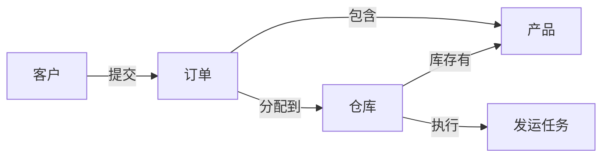

# 本体模型与本体建模方法

## 一、先看成果：一个可执行的本体模型长什么样

以“供应链订单管理”为例，一个最小但有用的本体模型可以表示为：



它不仅定义了概念，还定义了概念的属性、关系、约束和可执行动作：

```text
订单.status = 待处理 / 已分配 / 已发运 / 已完成 / 已取消
订单.priority = 普通 / 紧急
仓库.availableCapacity > 0

规则：紧急订单不能分配给库存不足的仓库
动作：重新分配订单
```

这就是“本体模型”：对一个领域中重要事物及其行为的结构化描述。

---

## 二、本体模型是什么

本体模型是对某个领域的**概念、属性、关系、约束、规则和行为**进行形式化表达的模型。

它通常包含六类元素：

| 元素 | 说明 | 示例 |
|---|---|---|
| 概念 / 类 | 领域中的事物类型 | 客户、订单、仓库 |
| 实例 | 某个具体事物 | 客户 C001、订单 O10086 |
| 属性 | 事物的特征 | 订单金额、仓库地址 |
| 关系 | 事物之间的联系 | 客户提交订单 |
| 约束 | 对结构或取值的限制 | 订单必须有客户 |
| 规则 / 行为 | 推理或可执行操作 | 风险订单需要审批 |

用抽象表示：

```text
Ontology Model = Classes
               + Properties
               + Relations
               + Constraints
               + Rules
               + Actions
```

不同技术实现可能使用不同名称：

```text
Class / Concept       ≈ Object Type / Entity
Instance              ≈ Object
Property              ≈ Attribute / Field
Relation              ≈ Link / Edge
Constraint            ≈ Validation / Cardinality
Rule                  ≈ Business Rule / Inference
Action                ≈ Operation / Workflow Command
```

---

## 三、本体模型的四个观察层次

### 1. 语义层：世界里有什么

定义业务对象和概念：

```text
客户、订单、产品、仓库、供应商
```

### 2. 结构层：它们如何组织

定义属性、关系、层级和基数：

```text
客户 1 ──提交──▶ N 订单
订单 N ──包含──▶ N 产品
仓库 1 ──拥有──▶ N 库存记录
```

### 3. 推理层：根据事实能得到什么结论

```text
如果库存不足，并且订单为紧急订单，
则订单状态为“供应风险”。
```

### 4. 运营层：可以对世界做什么

```text
重新分配订单
审批订单
创建补货任务
取消发运任务
```

前三层让系统“理解”领域，第四层让系统能够在权限和规则约束下“行动”。Palantir Ontology 特别强调这种从语义到运营的扩展：Object、Property、Link 表示业务世界，Function 和模型负责逻辑，Action Type 负责业务变更，Security 负责治理。

---

## 四、本体建模与数据库建模的区别

数据库建模首先关注数据如何存储，本体建模首先关注业务如何被理解和使用。

| 对比项 | 数据库建模 | 本体建模 |
|---|---|---|
| 出发点 | 表和字段 | 业务概念与决策 |
| 关注重点 | 存储、查询、完整性 | 语义、关系、推理、行动 |
| 典型对象 | 表、列、主键、外键 | 概念、实例、属性、关系 |
| 关系作用 | 连接记录 | 表达业务含义 |
| 规则位置 | 应用代码或数据库约束 | 本体规则、函数或决策逻辑 |
| 变更方式 | CRUD | 受治理的业务动作 |
| 使用者 | 开发人员和数据库管理员 | 业务人员、应用和 AI |

实际项目中，两者不是互相替代：数据库可以作为本体的数据基础，本体则为数据库数据提供业务语义和运营入口。

---

## 五、本体建模的标准流程

### 第 1 步：明确建模目标

不要从“有哪些表”开始，而要先确定：

```text
希望支持哪些业务决策？
谁会使用这个模型？
需要查询什么？
需要执行什么动作？
决策结果要写回哪些系统？
```

例如，目标可以是：

> 在配送中心发生故障时，自动识别受影响订单，推荐替代仓库，并让主管审核后完成重新分配。

### 第 2 步：识别领域边界

明确本体只覆盖哪些业务范围：

```text
覆盖：订单、库存、仓库、运输
暂不覆盖：财务总账、员工薪资、客户营销活动
```

边界不清会导致本体无限膨胀，最终既难维护，也难让使用者理解。

### 第 3 步：提取核心概念

从业务流程、表单、指标、岗位访谈和系统接口中提取名词。

筛选标准：

- 是否是业务人员经常讨论的对象？
- 是否有独立生命周期？
- 是否需要被查询或追踪？
- 是否可能成为决策的输入或输出？

例如，“订单”“仓库”“产品”通常应建模为概念，而“订单颜色”一般只是属性。

### 第 4 步：区分概念、实例和属性

常见错误是把实例直接当概念：

```text
错误：把“上海仓”建成一个类型
正确：定义“仓库”类型，再把“上海仓”建成一个实例
```

判断方法：如果未来还会出现多个同类对象，它通常应当是概念类型，而不是单独的概念。

### 第 5 步：定义属性和数据类型

为每个概念补充关键属性：

```yaml
Order:
  orderId: String        # 主键
  status: OrderStatus    # 枚举
  amount: Decimal        # 金额
  requiredDate: Date     # 日期
  priority: Priority     # 优先级
```

属性设计应同时考虑：名称、定义、单位、取值范围、是否必填、来源、更新时间和敏感等级。

### 第 6 步：定义关系和基数

关系名称应使用业务语言，而不是模糊的 `relatedTo`：

```text
客户 ──提交──▶ 订单
订单 ──分配到──▶ 仓库
仓库 ──存储──▶ 产品
```

同时明确：

```text
方向：谁对谁做什么？
基数：一对一、一对多，还是多对多？
必选性：关系是否必须存在？
有效期：关系从何时开始、何时结束？
```

### 第 7 步：定义约束和业务规则

把隐含在人工经验中的规则显式化：

```text
订单必须关联客户
订单金额不能小于 0
已发运订单不能修改分配仓库
库存不足时不能完成订单分配
```

规则应尽量可解释、可测试，并注明规则的责任人和生效范围。

### 第 8 步：定义行动和权限

对于每个重要动作，写清楚：

```text
动作名称：重新分配订单
输入参数：订单、目标仓库、原因
执行者：供应链主管
前置条件：订单处于风险状态，仓库库存足够
结果：更新订单、创建审计记录、通知物流系统
```

权限设计不能只写“谁能看”，还要写：

- 谁能查看对象？
- 谁能查看敏感属性？
- 谁能调用函数？
- 谁能执行动作？
- 谁能批准高风险动作？

### 第 9 步：映射真实数据源

建立本体概念与数据源之间的映射：

```text
ERP.sales_order.order_no       → Order.orderId
ERP.sales_order.customer_no    → Order.customerId
WMS.inventory.qty_available    → Inventory.availableQuantity
WMS.warehouse.warehouse_code   → DistributionCenter.centerId
```

需要确认：

- 主键是否稳定且唯一；
- 不同系统的 ID 如何对齐；
- 字段单位是否一致；
- 数据多久更新一次；
- 缺失值和冲突值如何处理；
- 用户编辑如何写回源系统。

### 第 10 步：用真实场景验证

至少使用一条完整业务流程进行验证：

```text
发现配送中心故障
→ 找到受影响订单
→ 计算替代仓库
→ 主管批准
→ 重新分配
→ 同步物流系统
→ 查询操作记录
```

如果某一步无法用模型表达，说明本体仍缺少对象、关系、规则、动作或权限。

---

## 六、完整示例模型

### 6.1 概念定义

```yaml
Customer:
  key: customerId
  properties: [name, region, creditLevel]

Order:
  key: orderId
  properties: [status, priority, amount, requiredDate]

Product:
  key: productId
  properties: [name, category, unit]

Warehouse:
  key: warehouseId
  properties: [name, location, operationalStatus]

Inventory:
  key: inventoryId
  properties: [availableQuantity, reservedQuantity, reorderPoint]
```

### 6.2 关系定义

```yaml
Customer -submits-> Order:
  cardinality: one-to-many

Order -contains-> Product:
  cardinality: many-to-many

Order -allocatedTo-> Warehouse:
  cardinality: many-to-one

Warehouse -hasInventory-> Inventory:
  cardinality: one-to-many

Inventory -forProduct-> Product:
  cardinality: many-to-one
```

### 6.3 规则定义

```text
R1：订单必须关联一个客户
R2：订单金额必须大于等于 0
R3：订单状态为“已发运”时，不能修改分配仓库
R4：可分配库存 = availableQuantity - reservedQuantity
R5：可分配库存小于订单需求量时，订单进入供应风险状态
```

### 6.4 行动定义

```yaml
Action: ReallocateOrder
inputs:
  - order
  - targetWarehouse
  - reason
criteria:
  - user.role == SupplyChainManager
  - order.status == AT_RISK
  - targetWarehouse.operationalStatus == OPEN
  - availableInventory >= requiredQuantity
effects:
  - update order.allocatedWarehouse
  - update order.status = REALLOCATED
  - create allocation decision record
  - notify warehouse and logistics systems
```

---

## 七、如何把本体模型映射到 Palantir Ontology

在 Palantir 语境下，可以大致这样对应：

| 本体建模概念 | Palantir Ontology 对象 |
|---|---|
| 领域概念 | Object Type |
| 具体实例 | Object |
| 属性 | Property |
| 业务关系 | Link Type |
| 共性能力 | Interface |
| 计算与推理 | Function、模型、规则 |
| 业务变更 | Action Type |
| 访问控制 | Object、Property、Action 和数据权限 |

Palantir 的 Object Type、Link Type、Action Type 和 Function 共同构成一个可用于应用和 AI 的运营模型；Ontology SDK 则可以让应用以类型安全的方式访问对象、调用函数和执行行动。[官方 Ontology overview](https://www.palantir.com/docs/foundry/ontology/overview)、[Ontology SDK](https://www.palantir.com/docs/foundry/ontology-sdk/overview)

---

## 八、建模质量检查清单

### 语义质量

- 概念名称是否使用业务人员的语言？
- 一个概念是否只有一个清晰含义？
- 是否区分了类型、实例和属性？

### 结构质量

- 主键是否稳定唯一？
- 关系方向和基数是否明确？
- 是否存在重复、循环或无意义关系？

### 规则质量

- 规则是否可解释、可测试？
- 是否定义了冲突规则的优先级？
- 规则是否注明责任人和生效范围？

### 数据质量

- 是否记录了数据来源和更新时间？
- 多个系统中的同一对象是否完成 ID 对齐？
- 缺失值、重复值和冲突值如何处理？

### 运营质量

- 关键决策是否有对应行动？
- 行动是否有提交条件、失败处理和审计记录？
- 用户编辑是否需要写回外部系统？

### 安全质量

- 对象、属性和行动是否分别定义权限？
- 是否区分查看、编辑、批准和执行权限？
- AI 是否只能调用被授权的函数和行动？

---

## 九、常见建模错误

### 错误一：从数据表复制本体

把每张表直接变成一个对象类型，通常会得到技术结构，而不是业务模型。应先理解业务对象，再建立数据映射。

### 错误二：关系命名过于模糊

`relatedTo` 几乎没有业务含义。应优先使用“提交”“分配到”“供应”“安装于”等明确动词。

### 错误三：把所有东西都建成对象

“订单”“仓库”适合作为对象；“订单颜色”“仓库名称”通常应作为属性。对象应该具有独立身份、生命周期或业务责任。

### 错误四：只有查询，没有行动

如果模型只能发现风险，却不能表达审批、分配、补货和通知，它仍然只是分析模型，而不是运营模型。

### 错误五：把权限留到最后处理

权限会影响对象设计、数据源划分、函数输入和行动边界。安全应在建模初期就参与设计。

### 错误六：模型过度追求“大而全”

更可行的做法是围绕一个高价值决策建立最小可用本体，再逐步扩展概念和关系。

---

## 十、最终理解

本体模型回答的是：

```text
这个领域有哪些事物？
它们有什么属性？
它们如何关联？
可以从哪些事实推导什么结论？
谁可以查看、修改或执行什么？
```

本体建模则是一套从业务目标出发，把这些问题转化为正式模型的过程：

```text
业务目标
  → 领域边界
  → 核心概念
  → 属性与关系
  → 约束与规则
  → 行动与权限
  → 数据映射
  → 场景验证
```

最好的本体不是最复杂的本体，而是能够让业务人员、数据系统、应用程序和 AI 对同一个业务世界形成一致理解，并且能够在受控条件下共同采取行动的本体。

---

## 十一、通用本体模型与 Palantir Ontology 的差异

### 11.1 先看结论

“本体模型”是一种通用的知识建模方法；Palantir Ontology 则是 Palantir Foundry/AIP 中的一套企业级、可运营的本体实现。

可以用下面的关系理解：

```text
通用本体理论 / 建模方法
            ↓
概念、属性、关系、约束、规则
            ↓
Palantir Ontology 的对象、链接、函数、行动和安全
            ↓
应用、AI Agent、自动化和外部系统写回
```

因此，二者不是简单的“谁替代谁”，而是**抽象方法**和**平台实现**的区别。

### 11.2 核心差异对比

| 对比维度 | 通用本体模型 | Palantir Ontology |
|---|---|---|
| 定位 | 知识表示和领域建模方法 | 企业运营平台中的本体系统 |
| 主要目标 | 统一概念、关系和语义 | 连接数据、逻辑、行动和安全，支持真实业务决策 |
| 核心元素 | 类、实例、属性、关系、约束、规则 | Object Type、Object、Property、Link Type、Function、Action Type、Security |
| 数据来源 | 通常需要另行设计数据接入 | 可映射 Foundry 数据集、虚拟表、流和模型等企业资产 |
| 逻辑能力 | 依赖规则引擎、推理机或应用代码 | Function、业务规则、机器学习模型、优化器和 AIP Logic |
| 行动能力 | 通常不属于本体核心，需外接工作流 | Action Type 原生定义、校验和执行业务变更 |
| 写回能力 | 取决于具体实现 | 支持 Ontology 编辑、writeback 和外部系统集成 |
| 安全能力 | 通常由外部 IAM、应用或数据库提供 | 对象、属性、链接、函数和行动均可纳入权限治理 |
| 应用接入 | 需要自行开发 API 和适配层 | 可通过 Ontology SDK、应用和 Foundry 工具直接使用 |
| AI 支持 | 需要额外开发 Agent 工具和权限机制 | AI 可在受授权的对象、函数和行动边界内工作 |
| 运行特征 | 可能是静态模型或知识库 | 面向实时查询、事务变更、自动化和人机协作 |
| 供应商绑定 | 通常与具体产品无关 | 与 Palantir Foundry、AIP、Ontology Engine 和 Toolchain 深度结合 |

### 11.3 概念映射

| 通用本体概念 | Palantir Ontology 对应物 | 说明 |
|---|---|---|
| 类 / 概念 | Object Type | 定义一种现实实体或事件的结构 |
| 实例 | Object | 某个具体客户、订单、车辆或零件 |
| 属性 | Property | 描述对象的字段、状态或业务特征 |
| 关系 | Link Type | 定义对象类型之间的业务连接 |
| 关系实例 | Link | 两个具体对象之间的一条关系 |
| 接口 / 共性能力 | Interface | 多个对象类型共享结构和能力 |
| 规则 | Submission Criteria、Ontology Rules、Function | 判断条件、数据编辑规则或计算逻辑 |
| 操作 / 命令 | Action Type | 在权限和条件约束下执行业务变更 |
| 推理 / 计算 | Function、模型、AIP Logic | 生成指标、预测、推荐或候选方案 |
| 访问控制 | Object、Property、Action Security | 控制查看、编辑、函数调用和行动执行 |

### 11.4 同一个业务问题的不同表达方式

以“重新分配订单”为例。

#### 通用本体模型通常这样描述

```text
概念：订单、仓库、产品
关系：订单分配到仓库，订单需要产品
规则：库存不足的仓库不能分配订单
```

它能够表达业务知识，但是否能真正修改订单、通知物流系统，取决于外部应用和工作流系统。

#### Palantir Ontology 会继续定义

```text
Object Types：Order、Warehouse、Product、Inventory
Links：Order allocatedTo Warehouse
Function：findAlternativeWarehouses(order)
Action Type：ReallocateOrder
Submission Criteria：用户角色、订单状态、库存数量、运输能力
Side Effects：通知 WMS、更新 TMS、创建审计记录
Security：限制可见订单、可用仓库和可执行动作
```

这里，模型从“描述事实”扩展为“支持并治理决策”。

### 11.5 Palantir Ontology 的独特侧重点

#### 1. 从语义模型走向运营模型

传统本体重点回答“某个概念是什么、与什么相关”；Palantir Ontology 还回答“现在能做什么，以及做完后系统状态如何变化”。

#### 2. 从读模型走向读写闭环

很多知识模型主要用于查询和分析。Palantir Ontology 将用户编辑、AI Agent 调用和外部系统同步纳入模型，让决策可以写回运营系统。

#### 3. 把安全绑定到业务动作

传统方案常在应用层判断按钮是否显示；Palantir 的 Action Type 还会在提交时重新验证用户、对象和实时业务条件，降低绕过前端限制的风险。

#### 4. 面向应用和 AI 的统一接口

同一个对象和行动可以被 Object Explorer、Workshop、自定义应用、Ontology SDK 和 AI Agent 复用，减少每个应用分别解释数据的需要。

#### 5. 强调企业级数据和决策治理

Palantir Ontology 通常需要同时处理数据血缘、对象权限、属性敏感性、行动审批、审计记录、版本演进和跨系统写回，这些内容超出了纯粹知识表示模型的范围。

### 11.6 需要避免的误解

1. **Palantir Ontology 不是一种唯一的行业本体标准。** 每家企业仍需自行决定订单、零件、车辆、质量事件等概念的边界和定义。
2. **Palantir Ontology 不等于 RDF/OWL。** 它可以借鉴本体和知识图谱思想，但其重点是企业运营、动作、安全和应用。
3. **使用 Palantir 不会自动得到正确的本体。** 数据质量、主键设计、关系语义、权限和流程仍需要领域专家共同定义。
4. **Function 不等于 Action。** Function 主要负责计算和判断，Action 负责经过治理的业务状态变更。
5. **AI 被锚定并不等于完全不会产生错误。** Ontology 能限制对象、工具和权限边界，但结果仍依赖数据、函数、模型和审批流程的质量。

### 11.7 选择和落地建议

如果目标是建立跨系统的统一业务词汇、知识图谱或数据标准，可以先使用通用本体建模方法。

如果目标还包括以下需求，则需要进一步考虑 Palantir Ontology 这类运营型实现：

- 需要直接连接 ERP、MES、CRM、IoT 和模型；
- 需要在同一模型上支持分析、应用和 AI Agent；
- 需要将建议转化为经过审批的业务动作；
- 需要把变更写回订单、库存、生产或售后系统；
- 需要对象级、属性级和行动级的细粒度安全；
- 需要对人和 AI 的决策进行统一审计。

最终可以这样概括：

```text
通用本体：定义“业务世界如何被理解”
Palantir Ontology：让这个业务世界可以被查询、计算、改变和治理
```

[返回本目录](README.md)
